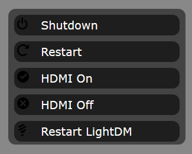

# Raspi-Control
A Node.js app that let's you control your Raspberry Pi remotely<br/><br/>


## Installation guide
1.Clone the repo
1. Edit the top of the index.js file so that it fits to your configuration:
```
var host = 'IPOFTHERASPBERRY',
	port = SSHPORT,
	user = 'USERNAME',
	password = 'PASSWORD';
```
1. Execute the following:
```
cd Raspi-Control
npm install
node index.js
```

You should now be able to access the control panel via
another computer on the network:
```
IPoftheRaspberry:2000
```
